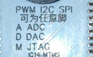
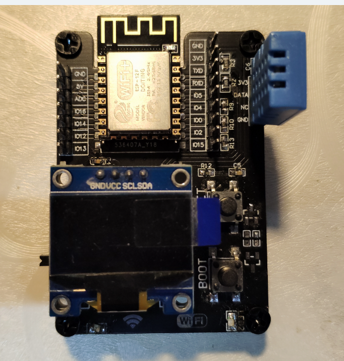

# ESP32 手持终端设计

#### 主要

* ESP32-Pico
* 12864 OLED
* 锂电池充放电
* 五维按键
* Boot/Reset
* type-C口，下载电路（CP2102/CH340等）
* WS2812
* ZigBee (CC2530)
* 预留SPI，UART接口

#### 要求

* 可以使用两张PCB，上下连接
* 引脚详细标注 
* 标记硬件I2C，SPI，引脚用途
* 外形参考  技小新开源的ESP8266开发板
* OLED用裸屏版本，右下角五位按键
* 纽扣电池与RTC
